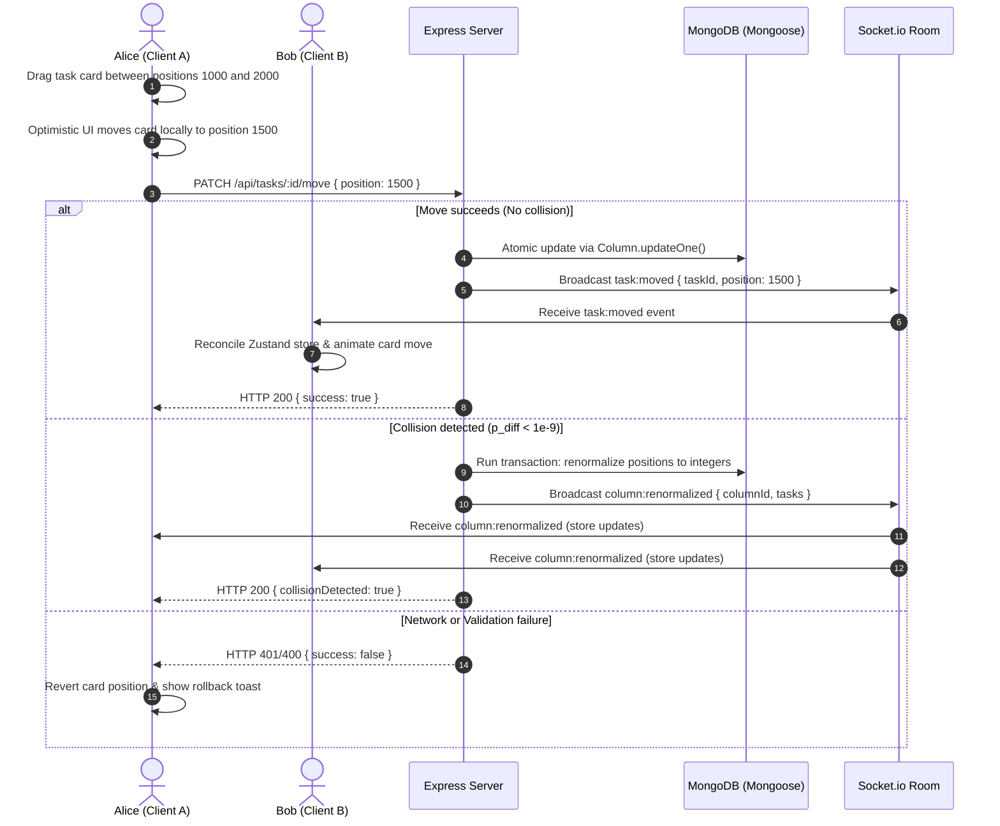

# TaskFlow

A real-time collaborative Kanban board engineered with fractional-index positioning and board-scoped WebSocket rooms.

[](#)
[](#)
[](#)

---

**Production Deployments (Standard Monorepo Configuration):**
*   **Frontend client (Vercel):** [https://taskflow-client-seven.vercel.app](https://taskflow-client-seven.vercel.app)
*   **Backend server (Render):** `https://<your-project>.onrender.com` (Point Render to monorepo root or `backend/` subdirectory)

---



## The 10-Second Pitch

Your teammate drags a task card to "In Progress". At the exact same microsecond, you drag the card below it. Instead of the UI glitching, double-updating, or throwing duplicate-key exceptions, TaskFlow processes the updates atomically, resolves coordinate spacing, and flashes the movement on your screen in real time. No spinners, no broken states.

---

## Table of Contents
1. [Why This Exists](#why-this-exists)
2. [What Makes It Different](#what-makes-it-different)
3. [Tech Stack](#tech-stack)
4. [How It Actually Works](#how-it-actually-works)
5. [Getting Started](#getting-started)
6. [Environment Variables](#environment-variables)
7. [Project Structure](#project-structure)
8. [Verification & Testing](#verification--testing)
9. [Roadmap](#roadmap)
10. [Honest Limitations](#honest-limitations)
11. [Contributing](#contributing)
12. [License](#license)

---

## Why This Exists

Most tutorial-level Kanban apps use simple array indexes for task ordering (e.g. array splicing on drag). When two users drag items in the same column concurrently, their state updates collide, causing cards to jump, disappear, or overwrite database records. TaskFlow was built to solve concurrent state reconciliation on high-activity boards.

---

## What Makes It Different

*   **Fractional Indexing**: Task coordinates are floating-point numbers. Dropping a card between two others calculates the midpoint ($p_{new} = \frac{p_{prev} + p_{next}}{2}$) rather than shifting every task index in the database. If coordinates collide under $10^{-9}$, the database automatically triggers an atomic renormalization block.
*   **Board-Scoped Event Bus**: WebSockets do not broadcast globally. Socket.io connections authenticate via JWT handshake cookies, joining scoped rooms `board:{boardId}`. Updates ignore the sender via custom client-sent `X-Socket-ID` headers to prevent double-rendering.
*   **Optimistic UI with Active Rollback**: Tasks are moved in the frontend DOM immediately. If the server rejects the request (due to permissions, connection drops, or coordinate locks), the Zustand store reverts the card to its backup position and notifies the user with a rollback toast.
*   **Spam Blocker & OTP Signups**: Blocks disposable email domains (e.g. `mailinator.com`, `10minutemail.com`) during registration. It enforces a 6-digit verification code sent via Nodemailer SMTP (falling back to a copyable console/screen widget in development mode).

---

## Tech Stack

| Layer | Technology | Rationale |
| :--- | :--- | :--- |
| **Frontend** | React 18 (Vite) | Quick render cycles, fast HMR compiles. |
| **Styling** | Tailwind CSS | Utility-first tokens with custom Ink Navy palette. |
| **State** | Zustand | Light, performant central store for live updates. |
| **Drag & Drop** | @dnd-kit/core | Flexible sensors with keyboard accessibility. |
| **Backend** | Node.js (Express ESM) | Consistent JSON APIs, native event handling. |
| **Database** | MongoDB + Mongoose | Document structure fits nested task entities. |
| **Real-time** | Socket.io v4 | Reliable WebSocket rooms with fallback polling. |
| **Auth** | Passport.js + JWT | Dual strategies supporting httpOnly secure cookies. |
| **Testing** | Jest + Supertest | Quick mock setups for database transaction checks. |

---

## How It Actually Works

The frontend maintains a single source of truth in a Zustand store. WebSocket events trigger local reducers that patch this store directly:

```javascript
// Example of in-place store patch for concurrent moves (useBoardStore.js)
handleSocketTaskMoved: (taskData) => set((state) => {
  const { taskId, fromColumnId, toColumnId, newPosition } = taskData;
  const updatedTasks = state.tasks.map(t => 
    t._id === taskId ? { ...t, columnId: toColumnId, position: newPosition } : t
  );
  return { tasks: updatedTasks.sort((a, b) => a.position - b.position) };
})
```

---

## Getting Started

### Prerequisites
*   Node.js (v18 or higher)
*   MongoDB Instance (Local Community Server or Atlas Cluster)

### Installation
1.  Clone the repository and install dependencies at the monorepo root:
    ```bash
    git clone https://github.com/your-username/taskflow.git
    cd taskflow
    npm run install:all
    ```

2.  Configure your environment file. Copy the template:
    ```bash
    cp backend/.env.example backend/.env
    ```

3.  Open `backend/.env` and specify your credentials (see the [Environment Variables](#environment-variables) section below).

4.  Start the development servers (backend on `5000`, frontend on `5173`):
    ```bash
    npm run dev
    ```

---

## Environment Variables

Configure these variables inside `backend/.env`:

| Variable | Location | Purpose | Example |
| :--- | :--- | :--- | :--- |
| `PORT` | Backend | Port number for Express server. | `5000` |
| `MONGODB_URI` | Backend | Connection string to database. | `mongodb://127.0.0.1:27017/taskflow` |
| `JWT_ACCESS_SECRET` | Backend | Encryption key for 15-minute access tokens. | `some_long_random_hash` |
| `JWT_REFRESH_SECRET` | Backend | Encryption key for 7-day refresh tokens. | `another_long_random_hash` |
| `FRONTEND_URL` | Backend | CORS white-listed origin. | `http://localhost:5173` |
| `SMTP_HOST` | Backend | (Optional) Host for Nodemailer OTP delivery. | `smtp.gmail.com` |
| `SMTP_USER` | Backend | (Optional) Email address for sending OTPs. | `support@taskflow.dev` |
| `SMTP_PASS` | Backend | (Optional) App password for mail sender account. | `abcd efgh ijkl mnop` |

---

## Project Structure

```text
taskflow/
├── backend/
│   ├── src/
│   │   ├── config/          # Passport strategies & email nodemailer config
│   │   ├── controllers/     # Board, Column, Task, and Auth controllers
│   │   ├── middleware/      # Auth guards, validation, and rate-limiting
│   │   ├── models/          # User, Board, Column, and Task Mongoose schemas
│   │   ├── routes/          # Express REST routes mapping
│   │   └── app.js           # Server application startup
│   ├── tests/               # Jest backend API integration tests
│   └── package.json
├── frontend/
│   ├── src/
│   │   ├── components/      # Task Details and Command Palette overlays
│   │   ├── hooks/           # useSocket WebSocket wrapper hook
│   │   ├── pages/           # Dashboard, Boards, and Register pages
│   │   ├── store/           # Zustand store client reducers
│   │   ├── utils/           # API request helper wrappers
│   │   └── App.jsx          # Route configurations
│   ├── tailwind.config.js   # Design system tokens and custom colors
│   └── package.json
└── package.json
```

---

## Verification & Testing

TaskFlow runs Jest integration tests to verify database constraints, authentication sessions, and transaction rollbacks.

Run the test suite:
```bash
npm run test:backend
```

### Test Scope:
*   `tests/auth.test.js`: Verifies registration domain blocks, OTP verifications, unverified account log blockers, and session terminations.
*   `tests/board.test.js`: Asserts default provision columns (auto-creating *To Do*, *In Progress*, *Done* columns) and authorization matrices.
*   `tests/concurrency.test.js`: Simulates concurrent moves to the same position to verify that duplicate index coordinate collisions are resolved.

---

## Honest Limitations

1.  **MongoDB Standalone Limitations**: Transactions are enabled on Mongoose writes. However, if MongoDB is running as a local standalone server (not a replica set), transactions fallback to non-transactional single-write updates, which may risk minor inconsistencies during crashes.
2.  **Local Disk File Storage**: Uploaded attachments are saved to the server's local filesystem (`backend/uploads`) rather than S3 or Cloudinary.
3.  **Client-Side WebSocket Buffer**: If a user disconnects, the socket closes and displays a reconnecting status pill. While it attempts to sync missed updates via timestamps upon reconnecting, deep offline editing is not supported.

---

## Roadmap

- [x] 6-Digit Email OTP registration and verification flows.
- [x] Disposable email blocker to filter fake/spam domains.
- [x] Direct board card deletion from the dashboard lists.
- [ ] Virtualized task track columns to support 500+ cards per column.
- [ ] PDF/CSV board backup and migration exporter.
- [ ] Slack Webhook integration for task assignments notifications.
- [ ] Board activity timeline charts.

---

## Contributing

1.  Fork the project.
2.  Create your Feature Branch (`git checkout -b feature/amazing-feature`).
3.  Commit your changes (`git commit -m 'Add amazing feature'`).
4.  Push to the branch (`git push origin feature/amazing-feature`).
5.  Open a Pull Request.

---

## License

Distributed under the MIT License. See `LICENSE` for more information.

---

*TaskFlow: No cards left behind, no race conditions tolerated.*
